# PTX-Docker

## Getting started

### Clone the project

```bash
git clone https://github.com/Prometheus-X-association/ptx-docker.git
```

### Copy the .env file

```bash
cp .env.sample .env
```

### Check the configuration

```bash
./check-configuration.sh
```

#### expected output

```bash
✅  Configuration check passed
```

### Run the docker compose

```bash
docker compose --profile "*" up -d --build
```

## Overview

The PTX-Docker project utilizes Docker Compose to provide a comprehensive PTX application environment. This setup allows for easy deployment, scaling, and management of the various components.

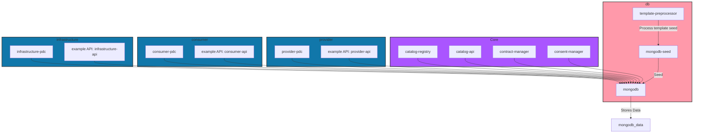

### Docker Compose Services

The `docker-compose.yml` file defines the services that make up the application. Each service is configured with its own settings, including build context, environment variables, ports, and dependencies. Below is a brief overview of the services defined in the `docker-compose.yml`:

### Services

1. **mongodb**:

   - Container for MongoDB, the database used by the application.
   - Uses a volume for persistent data storage.
   - Exposes ports defined by `MONGODB_PORT` and `MONGODB_DOCKER_PORT`.

2. **mongodb-seed**:

   - Initializes the MongoDB database with seed data.
   - Depends on the `mongodb` service to be running.

3. **template-preprocessor**:

   - Processes templates for seed data initialization.
   - Depends on the `mongodb-seed` service to be running.

4. [**catalog-registry**](https://github.com/Prometheus-X-association/catalog-registry):

   - The registry of reference models used in the ecosystem.
   - Exposes ports defined by `CATALOG_REGISTRY_BINDING_PORT` and `CATALOG_REGISTRY_PORT`.

5. [**catalog-api**](https://github.com/Prometheus-X-association/catalog-api):

   - Provides an API for accessing catalog data.
   - Exposes ports defined by `CATALOG_BINDING_PORT` and `CATALOG_PORT`.

6. [**contract-manager**](https://github.com/Prometheus-X-association/contract-manager):

   - Manages contracts.
   - Exposes ports defined by `CONTRACT_BINDING_PORT` and `CONTRACT_SERVER_PORT`.

7. [**consent-manager**](https://github.com/Prometheus-X-association/consent-manager):

   - Handles user consent management.
   - Exposes ports defined by `CONSENT_BINDING_PORT` and `CONSENT_PORT`.

8. [**provider-pdc**](https://github.com/Prometheus-X-association/dataspace-connector):

   - Represents the data provider service.
   - Exposes ports defined by `PROVIDER_PDC_BINDING_PORT` and `PROVIDER_PDC_PORT`.

9. [**consumer-pdc**](https://github.com/Prometheus-X-association/dataspace-connector):

   - Represents the service provider / data consumer.
   - Exposes ports defined by `CONSUMER_PDC_BINDING_PORT` and `CONSUMER_PDC_PORT`.

10. [**infrastructure-pdc**](https://github.com/Prometheus-X-association/dataspace-connector):

    - Represents the infrastructure service provider.
    - Exposes ports defined by `INFRASTRUCTURE_PDC_BINDING_PORT` and `INFRASTRUCTURE_PDC_PORT`.

11. [**example-api**](https://github.com/VisionsOfficial/sandbox-participant.git)( consumer-api/provider-api/infrastructure-api):
    - Simulates a very simple API Service that a Data / Service provider would run and provide to the dataspace.
    - Provides an API for infrastructure services.
    - Exposes ports defined by `INFRASTRUCTURE_API_BINDING_PORT` and `INFRASTRUCTURE_API_PORT`.
    - Exposes ports defined by `CONSUMER_API_BINDING_PORT` and `CONSUMER_API_PORT`.
    - Exposes ports defined by `PROVIDER_API_BINDING_PORT` and `PROVIDER_API_PORT`.

### Profiles

Profiles in Docker Compose allow you to define a subset of services that can be started together. This is useful for running different configurations of the ecosystem without modifying the `docker-compose.yml` file. For example, you can run only the database services or only the core dataspace services by specifying the profile when starting Docker Compose.

#### Available Profiles

Profiles can be combined to run multiple configurations at once.

1. **Core Profile**

   - This profile includes the core dataspace services necessary for the main functionality of the dataspace. It typically includes services like `catalog-registry`, `catalog-api`, `contract-manager`, and `consent-manager`.
   - To run the core profile, use the following command:

     ```bash
     docker-compose --profile core up
     ```

2. **Database Profile**

   - This profile includes the database-related services, primarily the `mongodb`, `template-preprocessor` and `mongodb-seed` services. It is useful for initializing and managing the database without starting the entire ecosystem of services.
   - To run the database profile, use the following command:

     ```bash
     docker-compose --profile db up
     ```

3. **provider Profile**

   - This profile includes the provider PDC service and an example API, which are essential for handling PDC interactions within the mocked dataspace.
   - To run the provider profile, use the following command:

     ```bash
     docker-compose --profile provider up
     ```

4. **consumer Profile**

   - This profile includes the consumer PDC service and an example API, which are essential for handling PDC interactions within the mocked dataspace.
   - To run the consumer profile, use the following command:

     ```bash
     docker-compose --profile consumer up
     ```

5. **infrastructure Profile**

   - This profile includes the infrastructure PDC service and an example API, which are essential for handling PDC interactions within the mocked dataspace.
   - To run the infrastructure profile, use the following command:

     ```bash
     docker-compose --profile infrastructure up
     ```

#### Running multiple Profiles

It's possible to run multiple profiles at once using a command like the following.

```bash
docker-compose --profile core --profile db up
```

#### Running All Profiles

If you want to run all services defined in the `docker-compose.yml` file, you can simply use the following command without specifying a profile:

```bash
docker-compose --profile "*" up -d
```

### Configuration Check Script

Before starting the application with Docker Compose, it is recommended to run the configuration check script to ensure that all environment variables and configurations are set correctly. The script is located at `ptx-docker/check-configuration.sh`.

#### How to Run the Configuration Check

1. Ensure that the `.env` file is present and correctly configured.
2. Run the following command:

```bash
bash ptx-docker/check-configuration.sh
```

The script performs the following checks:

- Validates the Docker Compose configuration.
- Checks for the existence of the `.env` file.
- Verifies that there are no duplicate ports defined in the `.env` file.
- Ensures that the `PORT` values for the consumer and provider services match the expected values.
- Constructs and verifies the expected URIs for various services, updating them in the configuration files if necessary.

If any issues are found, the script will output error messages indicating what needs to be corrected.

### Environment Variables (.env File)

The `.env` file is a very important element of the PTX-Docker project, as it defines the environment variables used by the various services in the Docker Compose configuration. These variables allow for easy configuration and customization of the ecosystem without modifying the source code directly.

#### Structure of the .env File

The `.env` file contains key-value pairs that specify various settings for the different services in the ecosystem. Below are the main sections and variables defined in the `.env` file:

1. **Catalog Registry**

   - `CATALOG_REGISTRY_API_KEY`: API key for the catalog registry service.
   - `CATALOG_REGISTRY_NODE_ENV`: Environment setting (e.g., development or production).
   - `CATALOG_REGISTRY_PORT`: Port on which the catalog registry service runs.
   - `CATALOG_REGISTRY_BINDING_PORT`: Port exposed for external access.
   - `CATALOG_REGISTRY_MONGO_*`: MongoDB configuration settings for the catalog registry.

2. **Catalog**

   - `CATALOG_NODE_ENV`: Environment setting for the catalog service.
   - `CATALOG_PORT`: Port for the catalog service.
   - `CATALOG_BINDING_PORT`: Port exposed for external access.
   - `CATALOG_MONGO_*`: MongoDB configuration settings for the catalog.

3. **Contract**

   - `CONTRACT_NODE_ENV`: Environment setting for the contract service.
   - `CONTRACT_SERVER_PORT`: Port for the contract service.
   - `CONTRACT_BINDING_PORT`: Port exposed for external access.
   - `CONTRACT_MONGO_*`: MongoDB configuration settings for the contract.

4. **Consent**

   - `CONSENT_NODE_ENV`: Environment setting for the consent service.
   - `CONSENT_PORT`: Port for the consent service.
   - `CONSENT_BINDING_PORT`: Port exposed for external access.
   - `CONSENT_MONGO_*`: MongoDB configuration settings for the consent.

5. **Provider, Consumer and Infrastructure PDC**

   - `PROVIDER_PDC_PORT`: Port for the provider PDC service.
   - `PROVIDER_PDC_BINDING_PORT`: Port exposed for external access.
   - `CONSUMER_PDC_PORT`: Port for the consumer PDC service.
   - `CONSUMER_PDC_BINDING_PORT`: Port exposed for external access.
   - `INFRASTRUCTURE_PDC_PORT`: Port for the infrastructure PDC service.
   - `INFRASTRUCTURE_PDC_BINDING_PORT`: Port exposed for external access.

6. **MongoDB**

   - `MONGODB_DOCKER_NAME`: Name of the MongoDB Docker container.
   - `MONGODB_SEED_DOCKER_NAME`: Name of the MongoDB seed Docker container.
   - `MONGODB_PORT`: Port for the MongoDB service.
   - `MONGODB_DOCKER_PORT`: Port used by the MongoDB container.

7. **Global setting**
   - `GLOBAL_URI`: by default `host.docker.internal` for Windows users but `172.17.0.1` can be used for linux user

> The `GLOBAL_URI` environment variable allows to use the same type of URI through the localhost machine and inside the docker environment instead of using localhost on the local machine and the `name:port` in the docker container.

#### Usage

To customize the application, you can modify the values in the `.env` file according to your environment and requirements. Ensure that the `.env` file is present in the root directory of the project before running the Docker Compose commands.

### Preconfiguration of the .env File

#### Internal and External Ports

Below is a summary of the internal and external ports used for each service defined in the `.env` file:

| Service | Internal Port | External Port | Description |
| --- | --- | --- | --- |
| **mongodb** | 27017 | 27018 | The MongoDB database service. |
| **mongodb-seed** | N/A | N/A | Initializes the MongoDB database with seed data. |
| **catalog-registry** | 3000 | [3000](http://localhost:3000/docs) | Manages the catalog of items in the application. |
| **catalog-api** | 3001 | [4040](http://localhost:4040/docs) | Provides an API for accessing catalog data. |
| **contract-manager** | 3002 | [8888](http://localhost:8888/docs) | Manages contracts within the application. |
| **consent-manager** | 3003 | [8887](http://localhost:8887/docs) | Handles user consent management. |
| **provider-pdc** | 3004 | [3333](http://localhost:3333/docs) | Represents the data provider |
| **consumer-pdc** | 3006 | [3335](http://localhost:3335/docs) | Represents the data consumer / service provider service. |
| **infrastructure-pdc** | 3008 | [3337](http://localhost:3337/docs) | Represents the infrastructure service provider. |
| **provider-api** | 3005 | [3334](http://localhost:3334) | Example API used in representation |
| **consumer-api** | 3007 | [3336](http://localhost:3336) | Example API used in representation |
| **infrastructure-api** | 3009 | [3338](http://localhost:3338) | Example API used in representation |

#### Explanation of Ports

- **Internal Ports**: These are the ports on which the services listen for incoming requests within the Docker network. They are used for communication between services.
- **External Ports**: These are the ports exposed to the host machine, allowing external access to the services. They are mapped to the internal ports to facilitate communication from outside the Docker network.

### Data Seed

This section provides an overview of the seed data used in the project. The seed data is essential for initializing the database with sample records that can be used for testing and development purposes.

#### Purpose

The seed data is designed to populate the MongoDB database with initial records for various entities, including participants, service offerings, and contracts. This allows developers to test the application with realistic data without needing to manually create records.

#### Structure

The seed data is organized into several JSON files located in the `ptx-docker/images/mongodb-seed/init/` directory. Each file corresponds to a specific entity type and follows the naming convention `database.collection.json`, where `database` is the name of the MongoDB database and `collection` is the name of the collection within that database.

- **catalog.datarepresentations.json**: Contains representations of data resources.
- **catalog.dataresources.json**: Lists the data resources available in the system.
- **catalog.ecosystems.json**: Defines the ecosystems that the data resources belong to.
- **catalog.globaldatatypes.json**: Specifies the global data types used across the application.
- **catalog.globalpurposes.json**: Outlines the global purposes for which data can be used.
- **catalog.organizationadmins.json**: Contains information about organization administrators.
- **catalog.participants.json**: Lists the participants in the ecosystem.
- **catalog.serviceofferings.json**: Describes the service offerings available.
- **catalog.softwarerepresentations.json**: Details the software representations.
- **catalog.softwareresources.json**: Lists the software resources available.
- **contract.contracts.json**: Contains contract definitions between participants.
- **consent.users.json**: Contains consent definitions for users.
- **consent.useridentifiers.json**: Contains consent definitions for useridentifiers.
- **consent.participants.json**: Contains consent definitions for participants.

#### Usage

The seed data is automatically loaded into the MongoDB database using the provided templates, which are processed to match the variables defined in the `.env` file.

#### Catalog

##### Participant

Three participants are created in the catalog following the seeding of data, you can login to the catalog using one of the following curl commands, specific to each created participant.

> Roles are defined as Data Provider, Data Consumer/Service Provider, Infrastructure Service Provider to explicitely represent a specific action that participant has within the bounds of the docker container ecosystem.
>
> It's worth noting that in a real world scenario, each participant can have multiple roles. Things are stripped down to the bare minimum and made as explicit as possible in this container to avoid over-complexifying the tests & interactions.

```bash
# Login as the data provider
curl -X POST http://host.docker.internal:4040/v1/auth/login \
  -H "Content-Type: application/json" \
  -d '{
    "email": "provider@yopmail.com",
    "password": "test"
  }'
```

```bash
# Login as the data consumer / service provider
curl -X POST http://host.docker.internal:4040/v1/auth/login \
  -H "Content-Type: application/json" \
  -d '{
    "email": "consumer@yopmail.com",
    "password": "test"
  }'
```

```bash
# Login as the infrastructure service provider
curl -X POST http://host.docker.internal:4040/v1/auth/login \
  -H "Content-Type: application/json" \
  -d '{
    "email": "infrastructure@yopmail.com",
    "password": "test"
  }'
```

##### Offer

#### Contract

With the seeding of data, there is also some contracts that are pre-generated, allowing for easy testing out of the box of pre-made components & participants. Here's an overview of how to get contracts in general and for the specific participants seeded in the docker container ecosystem.

```bash
# Get a contract
curl -X GET http://host.docker.internal:8888/contracts/67222aee85539771002f0abf \
  -H "Content-Type: application/json"
```

```bash
# Contracts for the data provider
curl -X GET http://host.docker.internal:8888/contracts/for/aHR0cDovL2hvc3QuZG9ja2VyLmludGVybmFsOjQwNDAvdjEvY2F0YWxvZy9wYXJ0aWNpcGFudHMvNjZkMTg3MjRlZTcxZjlmMDk2YmFlODEw \
  -H "Content-Type: application/json"
```

```bash
# Contracts for the data consumer / service provider
curl -X GET http://host.docker.internal:8888/contracts/for/aHR0cDovL2hvc3QuZG9ja2VyLmludGVybmFsOjQwNDAvdjEvY2F0YWxvZy9wYXJ0aWNpcGFudHMvNjZkMThhMWRlZTcxZjlmMDk2YmFlYzA4 \
  -H "Content-Type: application/json"
```

```bash
# Contracts for the infrastructure service provider
curl -X GET http://host.docker.internal:8888/contracts/for/aHR0cDovL2hvc3QuZG9ja2VyLmludGVybmFsOjQwNDAvdjEvY2F0YWxvZy9wYXJ0aWNpcGFudHMvNjU2NGFhZWJkODUzZThlMDViMTMxN2Mw \
  -H "Content-Type: application/json"
```

#### Connector

##### Login

To use the connector of a participant inside the docker container, you need to be authenticated to it. The following takes the information from the seeded data to allow you to login & retrieve JWTs to authenticate subsequent requests for the connector(s) you are logged into.

```bash
# Login as the data provider
curl -X POST http://host.docker.internal:3333/login \
  -H "Content-Type: application/json" \
  -d '{
    "serviceKey": "MLLgUPxnnZLxOAu5tbl_p9Bx_GKJFWJLVkic4jHOirGJjD_6zEbzcCosAhCw7zV_VA9fPYy_vdRkZLuebUAUoQgjAPZGPuI9zaXg",
    "secretKey": "xxRfHgwyb8OGYVuvdn13fwa8glsaFFwzB12laHzqoPs0PFw7HcA1DP6X8wkqEfZ4feUTwfdXO9WHGzlPwstMrE4FJVllcIl5U4nG"
  }'
```

```bash
# Login as the data consumer / service provider
curl -X POST http://host.docker.internal:3335/login \
  -H "Content-Type: application/json" \
  -d '{
    "serviceKey": "Gr31PY4J2SRCPdqS5eaGQPEB1Bk5WnucLE1heYoEm1DuwjnpPcOhhosS2s1hh1i9uVorj1GcN0kFLDfWC92TTx0iIaUBzs1UBmp1",
    "secretKey": "hmP5WG7vBFsj1fxNYWyzzO7zgczCBfkpfsu6TqpRxyshSBPqHXmXxPUCCisJTcqC6efrAf7KEMvYFzrtp2xkpWJWw8SueQ3BbN5H"
  }'
```

```bash
# Login as the infrastructure service provider
curl -X POST http://host.docker.internal:3337/login \
  -H "Content-Type: application/json" \
  -d '{
    "serviceKey": "dWJUUKH9rYF9wr_UAPb6PQXW9h17G7dzuGCbiDhcyjCGgHzLwBp6QHOQhDg0FFxS24GD8nvw37oe_LOjl7ztNATYiVOd_ZEVHQpT",
    "secretKey": "Qh4XvuhSJbOp8nMV1JtibAUqjp3w_efBeFUfCmqQW_Nl8x4t3Sk6fWiK5L05CB3jhKZOgY5JlBSvWkFBHH_6fFhYQZWXNoZxO78w"
  }'
```

##### Exchange

To trigger an exchange between participants from the seeded data, you have a couple options that are described here.

```bash
# Trigger exchange from the data provider's side
curl -X POST http://host.docker.internal:3333/consumer/exchange \
  -H "Content-Type: application/json" \
  -H "Authorization: Bearer ${JWT_TOKEN}" \
  -d '{
    "contract": "http://host.docker.internal:8888/contracts/67222aee85539771002f0abf",
    "purposeId": "http://host.docker.internal:4040/v1/catalog/serviceofferings/66d18b79ee71f9f096baecb0",
    "resourceId": "http://host.docker.internal:4040/v1/catalog/serviceofferings/66d187f4ee71f9f096bae8ca"
  }'
```

```bash
# Trigger exchange from the data consumer/service provider's side
curl -X POST http://host.docker.internal:3335/consumer/exchange \
  -H "Content-Type: application/json" \
  -H "Authorization: Bearer ${JWT_TOKEN}" \
  -d '{
    "contract": "http://host.docker.internal:8888/contracts/67222aee85539771002f0abf",
    "purposeId": "http://host.docker.internal:4040/v1/catalog/serviceofferings/66d18b79ee71f9f096baecb0",
    "resourceId": "http://host.docker.internal:4040/v1/catalog/serviceofferings/66d187f4ee71f9f096bae8ca"
  }'
```

##### Consent based exchange
***(WIP)***

##### Service chain protocol exchange

To run a Service Chain-based exchange, you can do so by running one of the following commands. Before trying, remember to:

1. Seed the data
2. Connect as the data provider or data consumer to his related PDC to retrieve the JWT as you will need it to authenticate these requests.

```bash
# Trigger exchange from the data provider's side
curl -X POST http://host.docker.internal:3333/consumer/exchange \
  -H "Content-Type: application/json" \
  -H "Authorization: Bearer  ${JWT_TOKEN}" \
  -d '{
    "contract": "http://host.docker.internal:8888/contracts/67222aee85539771002f0abf",
    "purposeId": "http://host.docker.internal:4040/v1/catalog/serviceofferings/66d18b79ee71f9f096baecb0",
    "resourceId": "http://host.docker.internal:4040/v1/catalog/serviceofferings/66d187f4ee71f9f096bae8ca",
    "dataProcessingId": "67bf015e3182b4376cfe4d1c"
  }'
```

```bash
# Trigger exchange from the data consumer / service provider's side
curl -X POST http://host.docker.internal:3333/consumer/exchange \
  -H "Content-Type: application/json" \
  -H "Authorization: Bearer  ${JWT_TOKEN}" \
  -d '{
    "contract": "http://host.docker.internal:8888/contracts/67222aee85539771002f0abf",
    "purposeId": "http://host.docker.internal:4040/v1/catalog/serviceofferings/66d18b79ee71f9f096baecb0",
    "resourceId": "http://host.docker.internal:4040/v1/catalog/serviceofferings/66d187f4ee71f9f096bae8ca",
    "dataProcessingId": "673ddc30f24a55c6c43b3e88"
  }'
```

```bash
# Trigger exchange on consumer side
curl -X POST http://host.docker.internal:3333/consumer/exchange \
  -H "Content-Type: application/json" \
  -H "Authorization: Bearer ${JWT_TOKEN}" \
  -d '{
    "contract": "http://host.docker.internal:8888/contracts/67222aee85539771002f0abf",
    "purposeId": "http://host.docker.internal:4040/v1/catalog/serviceofferings/66d18b79ee71f9f096baecb0",
    "resourceId": "http://host.docker.internal:4040/v1/catalog/serviceofferings/66d187f4ee71f9f096bae8ca",
    "dataProcessingId": "673ddca9db3b1ce116aec429"
  }'
```

## How to use a local pdc

*Local PDC* here means a PDC that is not included in the PTX-Docker environment directly but rather a PDC you run and maintain locally for testing / development purposes.

Using a *local pdc* means **taking the role* of one of the participants seeded in the environment to replace it. This is the easiest way to test your own connector & resource endpoint configurations.

### Local API

*Local API* here could be defined as
> A service providing a data or software resource that should be interconnected with by the connector at runtime during data exchanges.

This is essentially the actual resource providing the data / service that you provide metadata on when you register it on the catalogue.

Inside of the docker environment, each seeded participant has his associated "api" that is a very basic and simple application providing data or a service, with metadata that is seeded in the catalog and represented inside of the contracts.

### As a Data Provider

```bash
# if you use a local API, shutdown the provider's pdc and api
docker rm -f ptx-provider-pdc provider-api
```

```bash
# if you want to use the provided example API, shutdown only the provider pdc
docker rm -f ptx-provider-pdc
```

```bash
# copy the .env.production into you local pdc directory
cp ./images/provider-pdc/.env.production ../your-connector-directory/.env.production
```

```bash
# copy the config.production.json into you local pdc src directory
cp ./images/provider-pdc/config.production.json ../your-connector-directory/src/config.production.json
```

> <details><summary>Using npm</summary>
>
> ```bash
> # replace PORT and MONGO_URI
> PORT=3333
> MONGO_URI=mongodb://host.docker.internal:27018/ptx-provider
> ```
>
> ```bash
> # in your local pdc directory if you're using npm
> npm run build & npm run start
> ```
>
> </details>

> <details><summary>Using docker</summary>
>
> ```bash
> # in your local pdc directory
> docker compose up -d --build
> ```
>
> ```bash
> # add container to network
> docker network connecto ptx-main dataspace-connector
> ```
>
> </details>

### As Infrastructure Service Provider

```bash
# if you use a local API, shutdown both the pdc and api
docker rm -f ptx-infrastructure-pdc infrastructure-api
```

```bash
# if you want to use the provided example API, shutdown only the pdc
docker rm -f ptx-infrastructure-pdc
```

```bash
# copy the .env.production into you local pdc directory
cp ./images/infrastructure-pdc/.env.production ../your-connector-directory/.env.production
```

```bash
# copy the config.production.json into you local pdc src directory
cp ./images/infrastructure-pdc/config.production.json ../your-connector-directory/src/config.production.json
```

> <details><summary>Using npm</summary>
>
> ```bash
> # replace PORT and MONGO_URI
> PORT=3337
> MONGO_URI=mongodb://host.docker.internal:27018/ptx-infrastructure
> ```
>
> ```bash
> # in your local pdc directory if you're using npm
> npm run build & npm run start
> ```
>
> </details>

> <details><summary>Using docker</summary>
>
> ```bash
> # in your local pdc directory
> docker compose up -d --build
> ```
>
> ```bash
> # add container to network
> docker network connecto ptx-main dataspace-connector
> ```
>
> </details>

### As a Data Consumer / Service Provider

```bash
# if you use a local API, shutdown both the pdc and API
docker rm -f ptx-consumer-pdc consumer-api
```

```bash
# if you want to use the provided example API, shutdown only the pdc
docker rm -f ptx-consumer-pdc
```

```bash
# copy the .env.production into you local pdc directory
cp ./images/consumer-pdc/.env.production ../your-connector-directory/.env.production
```

```bash
# copy the config.production.json into you local pdc src directory
cp ./images/consumer-pdc/config.production.json ../your-connector-directory/src/config.production.json
```

> <details><summary>Using npm</summary>
>
> ```bash
> # replace PORT and MONGO_URI
> PORT=3335
> MONGO_URI=mongodb://host.docker.internal:27018/ptx-consumer
> ```
>
> ```bash
> # in your local pdc directory if you're using npm
> npm run build & npm run start
> ```
>
> </details>

> <details><summary>Using docker</summary>
>
> ```bash
> # in your local pdc directory
> docker compose up -d --build
> ```
>
> ```bash
> # add container to network
> docker network connecto ptx-main dataspace-connector
> ```
>
> </details>

## How to log an exchange

Logging exchanges provide detailed information about what happens in each connector during a data exchange workflow. This can be helpful to test, debug, or simply understand the intricacies of how the flow operates.

### PDC

Logs are usually accessible directly from the PDC applications, and are accessible with the following commands.

```bash
docker logs --follow ptx-provider-pdc
```

```bash
docker logs --follow ptx-infrastructure-pdc
```

```bash
docker logs --follow ptx-consumer-pdc
```

> <details><summary>Example basic exchange expected output</summary>
> provider-pdc
>
> 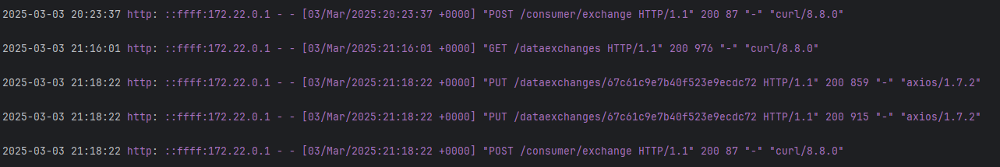
>
> consumer-pdc
>
> 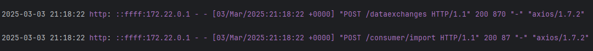
>
> </details>

> <details><summary>Example service chain protocol expected output</summary>
> provider-pdc
>
> 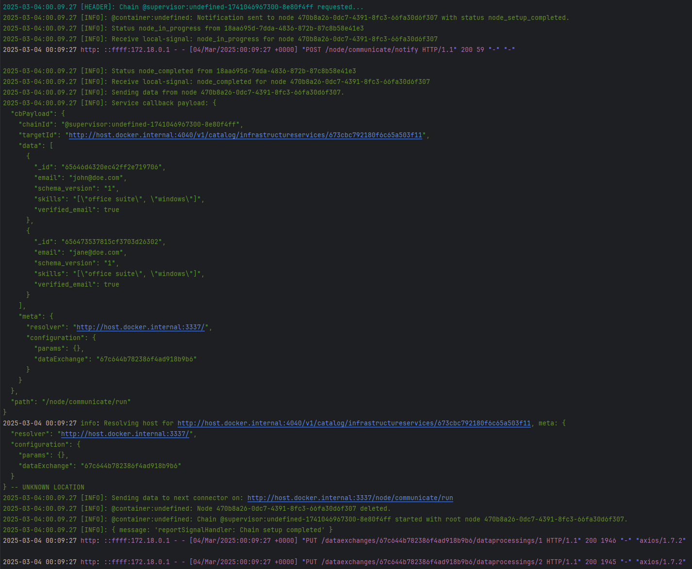
>
> consumer-pdc
>
> 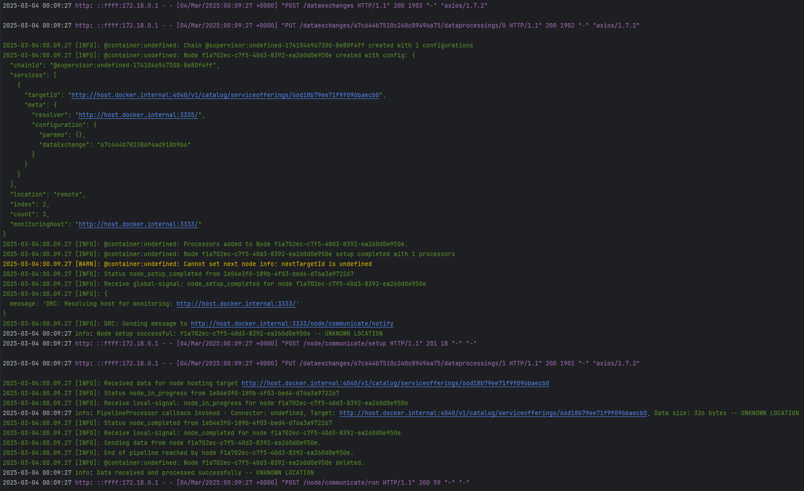
>
> infrastructure-pdc
>
> 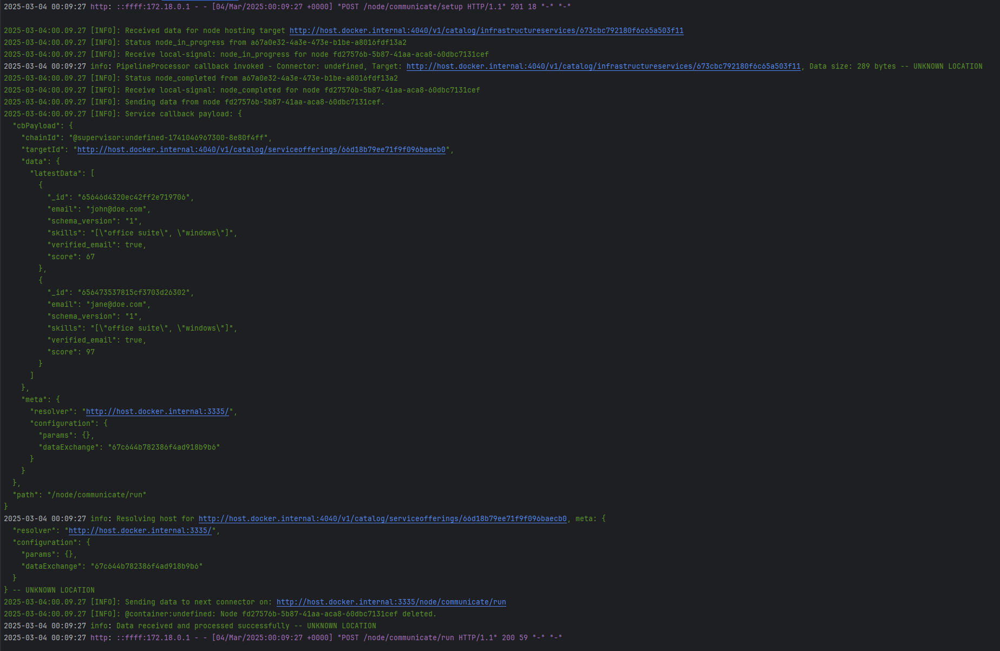
>
> </details>

### Example API

Although not as interesting as what happens within the PDC, sample APIs can also be logged for debug / testing purposes.

```bash
docker logs --follow provider-api
```

```bash
docker logs --follow infrastructure-api
```

```bash
docker logs --follow consumer-api
```

> <details><summary>Example basic exchange expected output</summary>
> provider-api
>
> 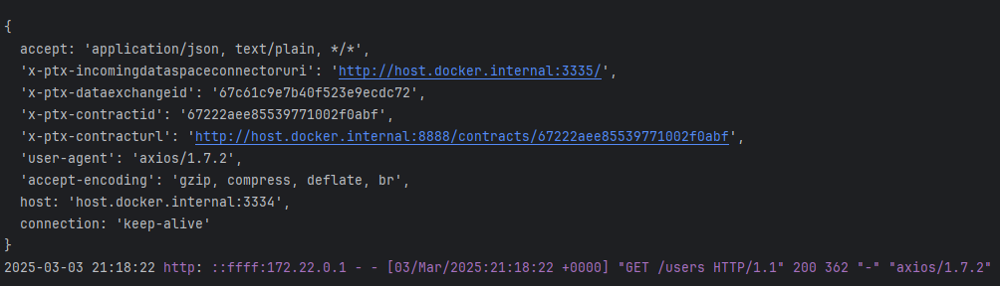
>
> consumer-api
>
> 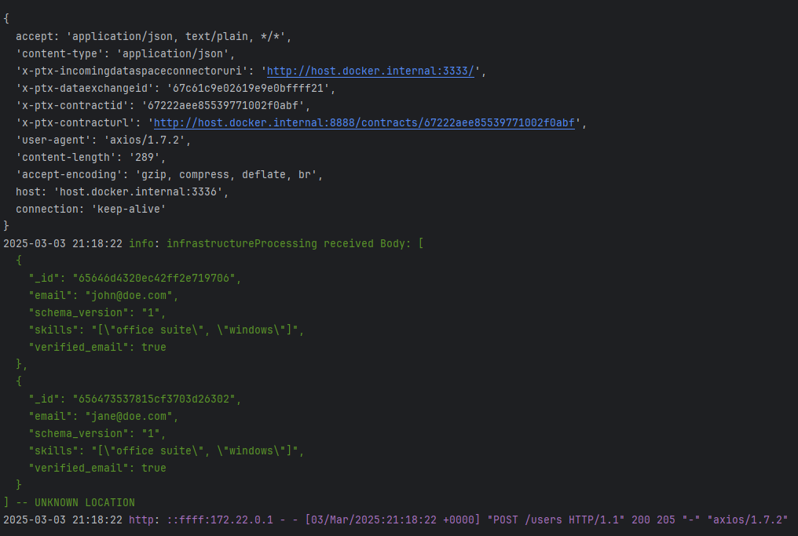
>
> </details>

> <details><summary>Example service chain protocol expected output</summary>
> provider-pdc
>
> 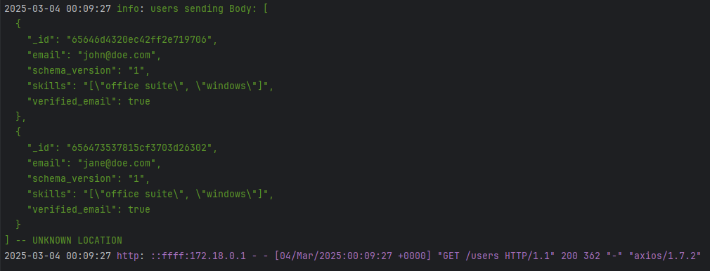
>
> consumer-pdc
>
> 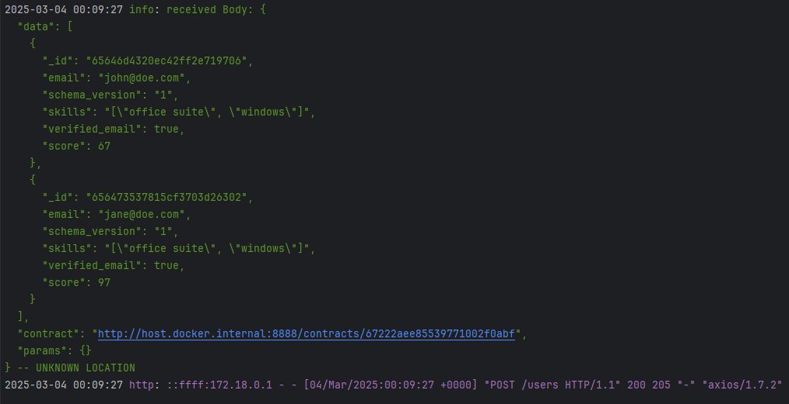
>
> infrastructure-pdc
>
> 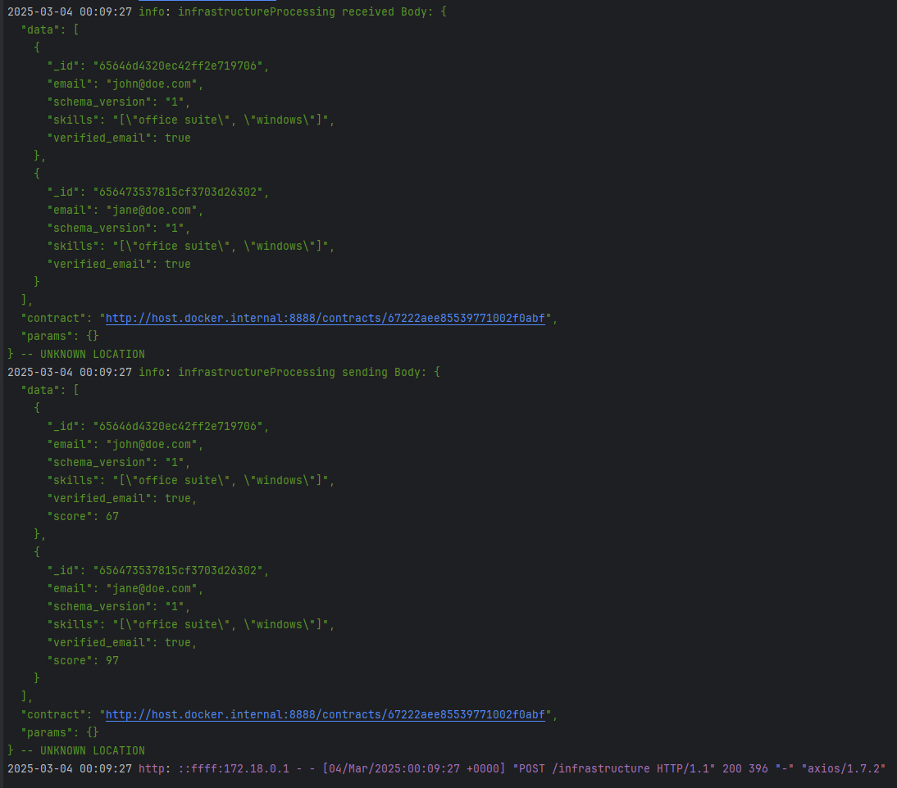
>
> </details>

### Data exchange

```bash
# Get all data exchanges
curl -X GET http://host.docker.internal:3333/dataexchanges \
  -H "Content-Type: application/json"
```

> <details><summary>Expected output</summary>
>
> ```json
> {
> 	"timestamp": 1741036561719,
> 	"code": 200,
> 	"content": [
> 		{
> 			"providerParams": {
> 				"query": []
> 			},
> 			"dataProcessing": {
> 				"infrastructureServices": []
> 			},
> 			"_id": "67c60fc97b40f523e9ecdc5f",
> 			"resources": [
> 				{
> 					"serviceOffering": "http://host.docker.internal:4040/v1/catalog/serviceofferings/66d187f4ee71f9f096bae8ca",
> 					"resource": "http://ptx-catalog-api:3001/v1/catalog/dataresources/66d1889cee71f9f096bae98b",
> 					"_id": "67c60fc97b40f523e9ecdc60"
> 				}
> 			],
> 			"purposeId": "http://host.docker.internal:4040/v1/catalog/serviceofferings/66d18b79ee71f9f096baecb0",
> 			"contract": "http://host.docker.internal:8888/contracts/67222aee85539771002f0abf",
> 			"consumerEndpoint": "http://host.docker.internal:3335/",
> 			"status": "IMPORT_SUCCESS",
> 			"createdAt": "2025-03-03T20:23:37.220Z",
> 			"__v": 0,
> 			"consumerDataExchange": "67c60fc902619e9e0bffff1b"
> 		}
> 	]
> }
> ```
>
> </details>

```bash
# Get one data exchange
curl -X GET http://host.docker.internal:3333/dataexchanges/67c60fc97b40f523e9ecdc5f \
  -H "Content-Type: application/json"
```

> <details><summary>Expected output</summary>
>
> ```json
> {
> 	"timestamp": 1741040039681,
> 	"code": 200,
> 	"content": {
> 		"providerParams": {
> 			"query": []
> 		},
> 		"dataProcessing": {
> 			"infrastructureServices": []
> 		},
> 		"_id": "67c60fc97b40f523e9ecdc5f",
> 		"resources": [
> 			{
> 				"serviceOffering": "http://host.docker.internal:4040/v1/catalog/serviceofferings/66d187f4ee71f9f096bae8ca",
> 				"resource": "http://ptx-catalog-api:3001/v1/catalog/dataresources/66d1889cee71f9f096bae98b",
> 				"_id": "67c60fc97b40f523e9ecdc60"
> 			}
> 		],
> 		"purposeId": "http://host.docker.internal:4040/v1/catalog/serviceofferings/66d18b79ee71f9f096baecb0",
> 		"contract": "http://host.docker.internal:8888/contracts/67222aee85539771002f0abf",
> 		"consumerEndpoint": "http://host.docker.internal:3335/",
> 		"status": "IMPORT_SUCCESS",
> 		"createdAt": "2025-03-03T20:23:37.220Z",
> 		"__v": 0,
> 		"consumerDataExchange": "67c60fc902619e9e0bffff1b"
> 	}
> }
> ```
>
> </details>

> You can log the data exchange on all connector, the data exchange is synchronize through all the connector used during the exchange

## Troubleshooting

### Known issues

1. ***Not having the latest version of one of the services inside the docker container environment***

If you don't have the latest version of one of the services you can use the following command to clean the image used by docker

```bash
docker system prune -a
```
